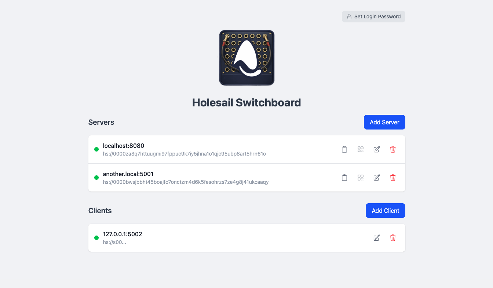

# Holesail Switchboard



A web interface to manage multiple [holesail](https://github.com/holesail/holesail) servers and clients for peer-to-peer connections.

## Features

- Create and manage multiple holesail servers
- Create and manage multiple holesail clients
- Real-time status monitoring (running, failed, disabled, initializing)
- QR code generation for server connection URLs
- Secure mode support for servers
- Persistent configuration storage

## Quick Start

Run directly with npx (no installation required):

```bash
npx holesail-switchboard
```

This will start the server and automatically open your browser.

## CLI Usage

```bash
# Run with default settings (opens browser automatically)
npx holesail-switchboard

# Specify a custom port
npx holesail-switchboard --port 4000

# Don't open browser on startup
npx holesail-switchboard --no-open

# Use a custom data file location
npx holesail-switchboard --data-file /path/to/data.json

# Combine options
npx holesail-switchboard -p 4000 -H 127.0.0.1 --no-open
```

### CLI Flags

| Flag | Description | Default |
|------|-------------|---------|
| `-d, --data-file <path>` | Path to data file | OS-specific (see below) |
| `-p, --port <number>` | Web dashboard UI port | 3000 |
| `-H, --host <address>` | Web dashboard UI host | 127.0.0.1 |
| `-c, --client-host <address>` | Host for Holesail clients to bind to | 127.0.0.1 |
| `--no-open` | Don't open browser on startup | (opens by default) |
| `-h, --help` | Show help | |

### Default Data File Locations

When `--data-file` is not specified and `HSSB_DATA_FILE` environment variable is not set:

- **macOS**: `~/Library/Application Support/holesail-switchboard/data.json`
- **Linux**: `~/.config/holesail-switchboard/data.json`
- **Windows**: `%APPDATA%/holesail-switchboard/data.json`

## Environment Variables

CLI flags take precedence over environment variables. Copy `.env.example` to `.env` to configure:

| Variable | Description | CLI Override |
|----------|-------------|--------------|
| `HSSB_DATA_FILE` | Path to JSON state file | `--data-file` |
| `HSSB_PORT` | Web dashboard UI port | `--port` |
| `HSSB_HOST` | Web dashboard UI host | `--host` |
| `HSSB_CLIENT_HOST` | Host for Holesail clients to bind to | `--client-host` |
| `HSSB_SUBTITLE` | Optional subtitle for the UI | |
| `HSSB_FIXED_CLIENT_PORTS` | Comma-separated list of fixed client ports | |

## Development Setup

1. Copy `.env.example` to `.env` and configure the variables
2. Run `npm install` to install dependencies
3. Run `npm run dev` for development or `npm run build && npm run start` for production
